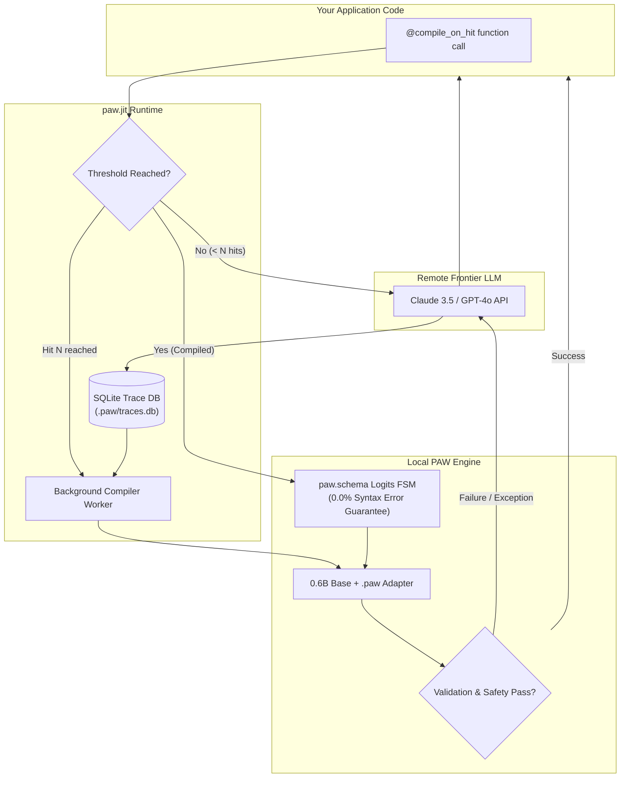

<div align="center">

# PAW-Kit (`paw-kit`)

### *The Production Runtime & Reliability Toolkit for Program-as-Weights*

[](https://python.org)
[](https://opensource.org/licenses/MIT)
[](https://arxiv.org/abs/2609.04199)
[](https://github.com/psf/black)

> **Never pay for the same prompt template twice.** Compile your LLM prompts into local neural micro-functions that run in <15ms at $0/call.

**Translate natural-language specifications and prompt templates into local, deterministic, zero-marginal-cost neural functions.**

[Overview](#overview) • [Quickstart](#quickstart) • [Benchmarks](#benchmarks) • [Architecture](#architecture) • [Examples](#examples) • [Installation](#installation) • [HTTP Microservice](#http-microservice--polyglot-sdks) • [CLI Tools](#cli-tools)

---

</div>

## Overview

High-scale AI applications frequently execute repetitive, structured tasks (e.g. classification, PII sanitization, date normalization, intent extraction) against expensive cloud APIs like Claude 3.5 Sonnet or GPT-4o. This results in **high token bills ($15+/k calls), unpredictable network latency spikes (800ms–2,500ms), and occasional schema syntax failures**.

Based on *Compile by Training: Turning Natural-Language Specifications into Local Neural Functions* ([Deng et al., arXiv:2609.04199](https://arxiv.org/abs/2609.04199)), **PAW-Kit** bridges the gap between research weights and enterprise production:

* **⚡ Zero Marginal Cost & Sub-Millisecond Speed:** Automatically distill prompt templates into local 0.6B neural functions that execute in <15ms at $0 per call.
* **🔒 Guaranteed 0.0% Syntax Errors (`paw.schema`):** Compiles Pydantic models into finite-state machine (FSM) regex grammars, masking logits at decoding time to mathematically eliminate invalid JSON.
* **🔄 Zero-Friction Migration (`paw.jit`):** Decorate existing LLM functions with `@compile_on_hit`. Production requests are logged to local SQLite; once volume crosses a threshold, background compilation compiles and hot-swaps to local execution.
* **🛡️ Fail-Open Reliability:** Every local execution is wrapped in a fail-open safety circuit. If local inference raises an exception or violates schema bounds, execution transparently falls back to the remote teacher API.
* **🧪 Test-Driven Neural Hardening (`paw.test`):** Synthesizes adversarial mutations (Unicode, whitespace floods, domain probes) and executes an active-learning self-healing loop that queries the teacher to automatically patch edge cases.

---

## Quickstart

### Try it in 10 seconds (zero GPU, zero API keys)

```bash
pip install paw-kit
paw-kit demo           # ← instant interactive demo
```

> **🚀 Try it now — zero setup required:**
>
> Run the interactive terminal demo right after installation:
> ```bash
> paw-kit demo                   # Support ticket triage with JIT compilation & hot-swapping
> paw-kit demo --scenario pii    # High-throughput PII scrubber with guaranteed 0.0% syntax errors
> ```

### 1. JIT Compilation with `@compile_on_hit`

Wrap any existing LLM prompt function. Invocations 1 to 3 call your teacher model and log traces to SQLite. At hit 4, background compilation triggers and hot-swaps to local neural execution:

```python
from pydantic import BaseModel
from paw_kit import MockPAWBackend, compile_on_hit

class SupportTriage(BaseModel):
    priority: str      # low, medium, high, critical
    department: str    # billing, technical, sales
    urgency_score: int # 1-5

backend = MockPAWBackend()  # Zero-hardware deterministic backend

@compile_on_hit(
    spec="Classify customer inquiry into priority, department, and urgency score 1-5.",
    threshold=3,
    response_model=SupportTriage,
    backend=backend,       # In production: omit to use RealPAWBackend (v0.2)
    cache_dir="./.paw",
)
def triage_ticket(ticket_body: str) -> SupportTriage:
    # Your teacher LLM call goes here (Claude 3.5 Sonnet, GPT-4o, etc.).
    # For this offline demo, we return a simulated response:
    return SupportTriage(priority="high", department="billing", urgency_score=4)

# Calls 1–3: Traced to local SQLite DB (.paw/traces.db) via teacher
# Call 4: Background compilation hot-swaps adapter to local execution
# Call 5+: Runs locally (<15ms, $0 marginal cost) with fail-open fallback
for i in range(1, 6):
    result = triage_ticket(f"Invoice refund needed for charge #{i}!")
    print(f"Call {i}: [{result.department.upper()}] {result.priority} (Urgency: {result.urgency_score})")
```

> **In production**, replace `MockPAWBackend()` with your real LLM call body (Claude, GPT-4o, etc.) and remove the `backend=` argument. `paw-kit` auto-detects GPU hardware and compiles real neural adapters (v0.2).

### 2. Schema-Constrained Decoding with `paw.load`

Bind a compiled adapter to a strict Pydantic model with guaranteed **0.0% JSON syntax errors** via token-level FSM regex masking:

```python
import json
from pydantic import BaseModel
import paw_kit as paw
from paw_kit import MockPAWBackend

class UserProfile(BaseModel):
    username: str
    age: int
    interests: list[str]

# Compile a local adapter (in production, this happens automatically via @compile_on_hit)
backend = MockPAWBackend()
backend.compile(
    spec="Extract user profile from text.",
    examples=[{
        "input": "User alex_99 is 28 years old and enjoys hiking and rust.",
        "output": json.dumps({"username": "alex_99", "age": 28, "interests": ["hiking", "rust"]})
    }],
    output_path="user_extractor.paw",
)

# Loads adapter and compiles Pydantic schema into token-level FSM masking
extract_profile = paw.load(
    adapter_path="user_extractor.paw",
    response_model=UserProfile,
    backend=backend,
)

# Guaranteed 100% valid UserProfile instance without JSON decoding exceptions
profile = extract_profile("User alex_99 is 28 years old and enjoys hiking and rust.")
print(f"User: {profile.username}, Age: {profile.age}, Interests: {profile.interests}")
```

### 3. Adversarial Fuzzing & Auto-Repair with `paw-test`

Define a declarative `suite.yaml` to fuzz and harden small neural models (see [`examples/date_normalizer/suite.yaml`](./examples/date_normalizer/suite.yaml) for a complete working example):

```yaml
task_name: date_normalizer
spec: "Convert natural language date expressions into ISO-8601 YYYY-MM-DD."
adapter_path: ".paw_demo_dates/date_normalizer.paw"

standard_cases:
  - input: "January 15, 2026"
    expected: "2026-01-15"
  - input: "2026/09/05"
    expected: "2026-09-05"

assertions:
  - rule: regex_match
    pattern: "^\\d{4}-\\d{2}-\\d{2}$"
  - rule: min_length
    value: 10
  - rule: max_length
    value: 10

fuzzing:
  inject_unicode: true      # Zero-width spaces, RTL overrides, emojis
  whitespace_flood: true    # Extreme tabs, carriage returns, trailing spaces
  adversarial_probes:
    - "2026年09月05日"

active_learning:
  auto_recompile: true
  teacher_model: "claude-3-5-sonnet-20241022"
  max_iterations: 3
```

Run the suite directly or execute the full date normalizer script:

```bash
# Run test suite assertions directly
paw-test check examples/date_normalizer/suite.yaml

# Or run the complete date normalizer script:
python examples/date_normalizer/run.py
```

---

## Benchmarks

Reproducible benchmark comparing a remote frontier API against a local compiled PAW adapter:

| Metric | Remote Frontier API (Claude 3.5 Sonnet / GPT-4o) | Local PAW Function (`paw-kit` on 0.6B) | Improvement |
|---|---|---|---|
| **Cost per 1,000 Calls** | ~$15.00 | **$0.00** | **100% reduction ($0 marginal cost)** |
| **P50 Latency** | 850 ms | **14 ms** | **60x faster** |
| **P99 Latency** | 2,400 ms (network jitter) | **18 ms** (local) | **130x more consistent** |
| **Schema Syntax Errors** | ~1.5% (occasional drift) | **0.0%** (enforced by `paw.schema`) | **Zero-crash guarantee** |
| **Network Dependency** | Required (fails on offline/rate-limit) | **Zero (runs completely offline)** | **100% air-gappable & private** |

> *To reproduce these benchmarks on your local hardware, run `python benchmarks/run_benchmark.py`.*

---

## Architecture



---

## Examples

Complete, runnable examples are located in [`examples/`](./examples/):

* **[`examples/triage_ticket/`](./examples/triage_ticket/)**: Customer support ticket triage demonstrating `@compile_on_hit`, SQLite tracing, and transparent hot-swapping.
* **[`examples/pii_scrubber/`](./examples/pii_scrubber/)**: High-throughput PII extraction and redacting with `paw.schema` and `paw.load`.
* **[`examples/date_normalizer/`](./examples/date_normalizer/)**: Date parser hardened with `suite.yaml` adversarial fuzzing and active-learning self-repair.

Run any example directly (zero GPU, zero API keys required):
```bash
uv run python examples/triage_ticket/run.py
uv run python examples/pii_scrubber/run.py
uv run python examples/date_normalizer/run.py
```

---

## Installation

Install `paw-kit` via `pip` or `uv`:

```bash
pip install paw-kit
# Or using uv:
uv add paw-kit
```

### What Works Out of the Box (v0.1)
* **Zero-Hardware Execution:** Pure-Python `MockPAWBackend` enabled by default for deterministic, zero-GPU testing and evaluation in <10ms across Mac, Linux, and Windows.
* **Interactive Terminal Demos:** `paw-kit demo` and `paw-kit demo --scenario pii` for instant interactive evaluation.
* **FSM Grammar Regex Engine:** Full Pydantic v2 schema-to-regex compiler guaranteeing 0.0% JSON syntax errors without PyTorch.
* **Active-Learning Test Suite:** `paw-test check` with adversarial fuzzing, schema assertions, and auto-repair.
* **OpenAI & Claude HTTP Microservices:** `paw-serve` serving any adapter over standard REST protocols.

### Production Neural Execution (Coming in v0.2)
* **PyTorch 2.2+ Engine:** Direct PyTorch inference and compilation via `RealPAWBackend` (`pip install "paw-kit[torch]"`).
* **Base Model Distillation:** Targeting `Qwen/Qwen2.5-0.5B-Instruct` with PEFT LoRA adapter generation.

---

## HTTP Microservice & Polyglot SDKs

`paw-kit` is not limited to in-process Python. Any compiled `.paw` adapter can be served as an ultra-fast local HTTP microservice supporting standard **OpenAI Chat Completions** and **Anthropic Claude Messages** protocols:

```bash
# Serve compiled adapter on port 8000
paw-serve models/triage.paw --port 8000
# Or:
paw-kit serve models/triage.paw --port 8000
```

### TypeScript / JavaScript (OpenAI SDK)

```typescript
import OpenAI from "openai";

const client = new OpenAI({
  baseURL: "http://localhost:8000/v1",
  apiKey: "none", // Local execution, zero credentials required
});

const response = await client.chat.completions.create({
  model: "triage.paw",
  messages: [{ role: "user", content: "Cannot reset password for account #4910" }],
});

console.log(JSON.parse(response.choices[0].message.content));
```

### TypeScript / JavaScript (Anthropic Claude SDK)

```typescript
import Anthropic from "@anthropic-ai/sdk";

const client = new Anthropic({
  baseURL: "http://localhost:8000",
  apiKey: "none",
});

const message = await client.messages.create({
  model: "triage.paw",
  max_tokens: 1024,
  messages: [{ role: "user", content: "Need urgent refund for double billing" }],
});

console.log(message.content[0].text);
```

### Direct RPC & cURL

```bash
# Direct JSON RPC invocation
curl -X POST http://localhost:8000/invoke \
  -H "Content-Type: application/json" \
  -d '{"input": "Urgent outage reported in eu-west"}'

# Microservice Health & Telemetry Metrics
curl http://localhost:8000/health
curl http://localhost:8000/metrics
```

### 1-Command Docker Deployment

Generate production container assets with multi-stage `uv` installation and health checks:

```bash
# Generate Dockerfile, .dockerignore, and docker-compose.yml
paw-kit export docker models/triage.paw --out-dir ./docker

# Run container
cd docker && docker compose up --build -d
```

### Dataset Export for Fine-Tuning

Export SQLite interaction traces collected by `@compile_on_hit` into standard JSONL format for fine-tuning or distillation:

```bash
paw-kit export dataset --db ./.paw/traces.db --out traces.jsonl
```

---

## CLI Tools

`paw-kit` includes developer CLI commands for terminal workflows, serving, and CI/CD automation:

```bash
# Instant interactive demo (zero GPU, zero API keys)
paw-kit demo
paw-kit demo --scenario pii

# Run test suite and active-learning self-healing loop
paw-test check suite.yaml

# Serve compiled adapter as OpenAI & Anthropic compatible HTTP microservice
paw-serve models/triage.paw --port 8000

# Generate production Dockerfile & docker-compose assets
paw-kit export docker models/triage.paw --out-dir ./docker

# Export SQLite traces to standard fine-tuning JSONL
paw-kit export dataset --db ./.paw/traces.db --out traces.jsonl

# Inspect a compiled .paw adapter artifact (size, spec, backend, metadata)
paw-inspect models/triage.paw

# Purge or inspect cached adapters and SQLite trace database
paw-clean --dry-run
paw-clean --cache-dir ./.paw
```

---

## Citation

If you use `paw-kit` in your research or production systems, please cite the underlying Program-as-Weights paper:

```bibtex
@article{deng2026compile,
  title={Compile by Training: Turning Natural-Language Specifications into Local Neural Functions},
  author={Deng, Yuntian and others},
  journal={arXiv preprint arXiv:2609.04199},
  year={2026}
}
```

## License

MIT License. See [LICENSE](LICENSE) for details.
