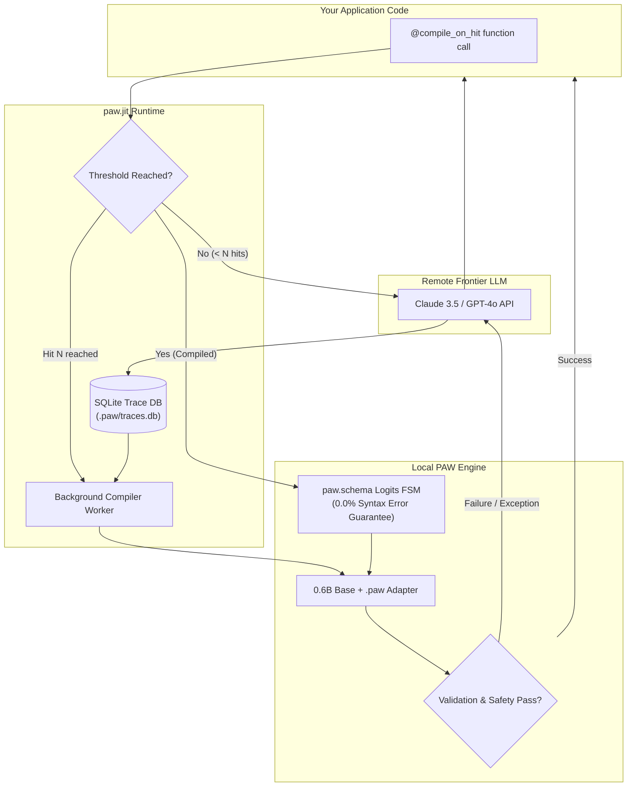

<div align="center">

# PAW-Kit (`paw-kit`)

### *The Production Runtime & Reliability Toolkit for Program-as-Weights*

[](https://python.org)
[](https://opensource.org/licenses/MIT)
[](https://arxiv.org/abs/2609.04199)
[](https://github.com/psf/black)

**Translate natural-language specifications and prompt templates into local, deterministic, zero-marginal-cost neural functions.**

[Overview](#overview) • [Benchmarks](#benchmarks) • [Quickstart](#quickstart) • [Architecture](#architecture) • [CLI Tools](#cli-tools) • [Examples](#examples)

---

</div>

## Overview

High-scale AI applications frequently execute repetitive, structured tasks (e.g. classification, PII sanitization, date normalization, intent extraction) against expensive cloud APIs like Claude 3.5 Sonnet or GPT-4o. This results in **high token bills ($15+/k calls), unpredictable network latency spikes (800ms–2,500ms), and occasional schema syntax failures**.

Based on *Compile by Training: Turning Natural-Language Specifications into Local Neural Functions* ([Deng et al., arXiv:2609.04199](https://arxiv.org/abs/2609.04199)), **PAW-Kit** bridges the gap between research weights and enterprise production:

* **⚡ Zero Marginal Cost & Sub-Millisecond Speed:** Automatically distill prompt templates into local 0.6B neural functions that execute in <15ms at $0 per call.
* **🔒 Guaranteed 0.0% Syntax Errors (`paw.schema`):** Compiles Pydantic models into finite-state machine (FSM) regex grammars, masking logits at decoding time to mathematically eliminate invalid JSON.
* **🔄 Zero-Friction Migration (`paw.jit`):** Decorate existing LLM functions with `@compile_on_hit`. Production requests are logged to local SQLite; once volume crosses a threshold, background compilation compiles and hot-swaps to local execution.
* **🛡️ Fail-Open Reliability:** Every local execution is wrapped in a fail-open safety circuit. If local inference raises an exception or violates schema bounds, execution transparently falls back to the remote teacher API.
* **🧪 Test-Driven Neural Hardening (`paw.test`):** Synthesizes adversarial mutations (Unicode, whitespace floods, domain probes) and executes an active-learning self-healing loop that queries the teacher to automatically patch edge cases.

---

## Benchmarks

Reproducible benchmark comparing a remote frontier API against a local compiled PAW adapter:

| Metric | Remote Frontier API (Claude 3.5 Sonnet / GPT-4o) | Local PAW Function (`paw-kit` on 0.6B) | Improvement |
|---|---|---|---|
| **Cost per 1,000 Calls** | ~$15.00 | **$0.00** | **100% reduction ($0 marginal cost)** |
| **P50 Latency** | 850 ms | **14 ms** | **60x faster** |
| **P99 Latency** | 2,400 ms (network jitter) | **18 ms** (local) | **130x more consistent** |
| **Schema Syntax Errors** | ~1.5% (occasional drift) | **0.0%** (enforced by `paw.schema`) | **Zero-crash guarantee** |
| **Network Dependency** | Required (fails on offline/rate-limit) | **Zero (runs completely offline)** | **100% air-gappable & private** |

> *To reproduce these benchmarks on your local hardware, run `python benchmarks/run_benchmark.py`.*

---

## Architecture



---

## Installation

Install `paw-kit` via `pip` or `uv`:

```bash
pip install paw-kit
# Or using uv:
uv add paw-kit
```

### Hardware Support
* **Development / CI:** Ships with pure-Python `MockPAWBackend` enabled by default for zero-GPU deterministic testing in milliseconds.
* **Production GPU:** Optional PyTorch 2.2+ and Hugging Face `transformers` runtime automatically bridges to upstream PAW weights via `RealPAWBackend`.

---

## Quickstart

### 1. JIT Compilation with `@compile_on_hit`

Wrap any existing LLM prompt function. Invocations 1 to 49 call your teacher model and log traces. At hit 50, background compilation triggers and hot-swaps to local neural execution:

```python
from pydantic import BaseModel
from paw_kit import compile_on_hit

class SupportTriage(BaseModel):
    priority: str      # low, medium, high, critical
    department: str    # billing, technical, sales
    urgency_score: int # 1-5

@compile_on_hit(
    spec="Classify customer inquiry into priority, department, and urgency score 1-5.",
    threshold=50,
    response_model=SupportTriage,
    cache_dir="./.paw"
)
def triage_ticket(ticket_body: str) -> SupportTriage:
    # Calls remote frontier model until 50 examples are collected
    return call_claude_api(ticket_body)

# Call 1-49: Runs Claude API (~850ms, $0.015/call)
# Call 50: Background compilation triggers
# Call 51+: Runs locally (<15ms, $0.00/call) with fail-open fallback
result = triage_ticket("We need an urgent invoice refund for charge #4912")
print(result.department, result.priority)
```

### 2. Schema-Constrained Decoding with `paw.load`

Bind a compiled `.paw` adapter to a strict Pydantic model with guaranteed schema compliance:

```python
from pydantic import BaseModel
import paw_kit as paw

class UserProfile(BaseModel):
    username: str
    age: int
    interests: list[str]

# Loads adapter and compiles Pydantic schema into token-level FSM masking
extract_profile = paw.load(
    adapter_path="user_extractor.paw",
    response_model=UserProfile,
    fallback_provider=call_claude_api
)

# Guaranteed 100% valid UserProfile instance without JSON decoding exceptions
profile = extract_profile("User alex_99 is 28 years old and enjoys hiking and rust.")
```

### 3. Adversarial Fuzzing & Auto-Repair with `paw-test`

Define a declarative `suite.yaml` to fuzz and harden your small neural models:

```yaml
task_name: date_normalizer
spec: "Convert natural language date expressions into ISO-8601 YYYY-MM-DD."
adapter_path: "models/date_normalizer.paw"

standard_cases:
  - input: "January 15, 2026"
    expected: "2026-01-15"
  - input: "2026/09/05"
    expected: "2026-09-05"

assertions:
  - rule: regex_match
    pattern: "^\d{4}-\d{2}-\d{2}$"
  - rule: min_length
    value: 10
  - rule: max_length
    value: 10

fuzzing:
  inject_unicode: true      # Zero-width spaces, RTL overrides, emojis
  whitespace_flood: true    # Extreme tabs, carriage returns, trailing spaces
  adversarial_probes:
    - "2026年09月05日"

active_learning:
  auto_recompile: true
  teacher_model: "claude-3-5-sonnet-20241022"
  max_iterations: 3
```

Run the suite from the command line:

```bash
paw-test check suite.yaml
```

The test runner evaluates adversarial inputs, queries the teacher for ground truth on failures, augments the training set, and recompiles the adapter until 100% of assertions pass.

---

## CLI Tools

`paw-kit` includes developer CLI commands for terminal workflows and CI/CD automation:

```bash
# Run test suite and active-learning self-healing loop
paw-test check suite.yaml

# Inspect a compiled .paw adapter artifact (size, spec, backend, metadata)
paw-inspect models/triage.paw

# Purge or inspect cached adapters and SQLite trace database
paw-clean --dry-run
paw-clean --cache-dir ./.paw
```

---

## Examples

Complete, runnable examples are located in [`examples/`](./examples/):

* **[`examples/triage_ticket/`](./examples/triage_ticket/)**: Customer support ticket triage demonstrating `@compile_on_hit`, SQLite tracing, and transparent hot-swapping.
* **[`examples/pii_scrubber/`](./examples/pii_scrubber/)**: High-throughput PII extraction and redacting with `paw.schema` and `paw.load`.
* **[`examples/date_normalizer/`](./examples/date_normalizer/)**: Date parser hardened with `suite.yaml` adversarial fuzzing and active-learning self-repair.

Run any example directly:
```bash
uv run python examples/triage_ticket/run.py
uv run python examples/pii_scrubber/run.py
uv run python examples/date_normalizer/run.py
```

---

## Citation

If you use `paw-kit` in your research or production systems, please cite the underlying Program-as-Weights paper:

```bibtex
@article{deng2026compile,
  title={Compile by Training: Turning Natural-Language Specifications into Local Neural Functions},
  author={Deng, Yuntian and others},
  journal={arXiv preprint arXiv:2609.04199},
  year={2026}
}
```

## License

MIT License. See [LICENSE](LICENSE) for details.
